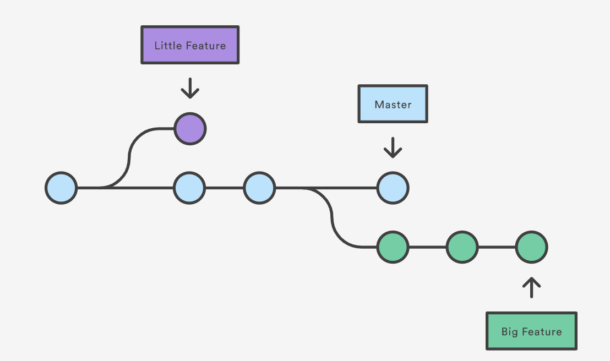

## Branching in Github

Git makes both Branching and Merging a lot easier than previous tools and thus many workflows rely upon them. A branch is just a timeline of commits stemming out of a particular commit point. More accuretely, branches are the names and labels we give timelines to Git.  We can create and delete branches without affecting timelines. All we are doing is creating or deleting labels of commit ranges in git. So far we have talked about the default Master Branch. Now we can create a new Branch to do a bit of work and then rejoined the master Branch by merging and any changes that occurred on the new Branch while merging get tries it's best to automatically merge when possible 

