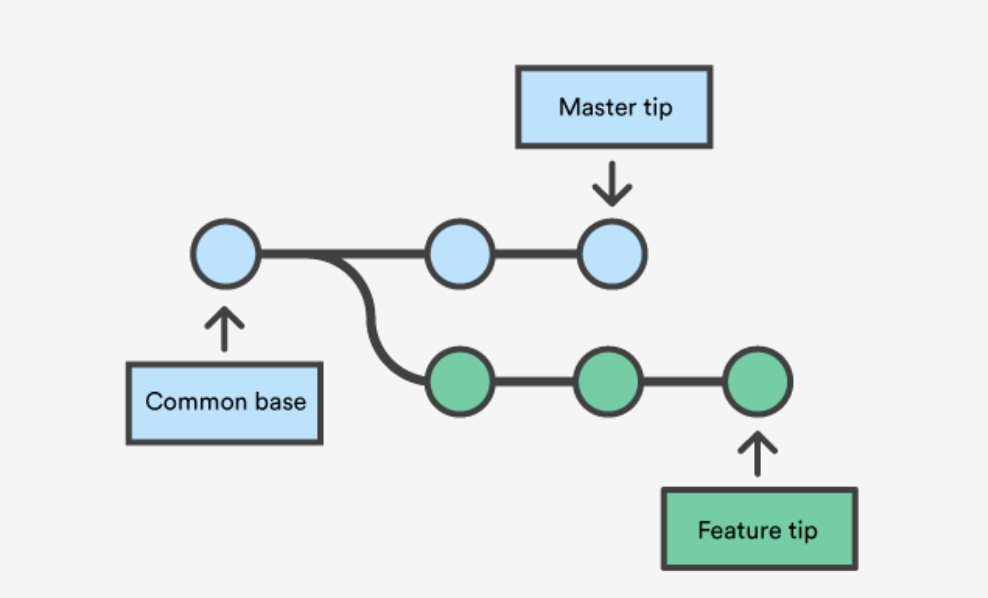
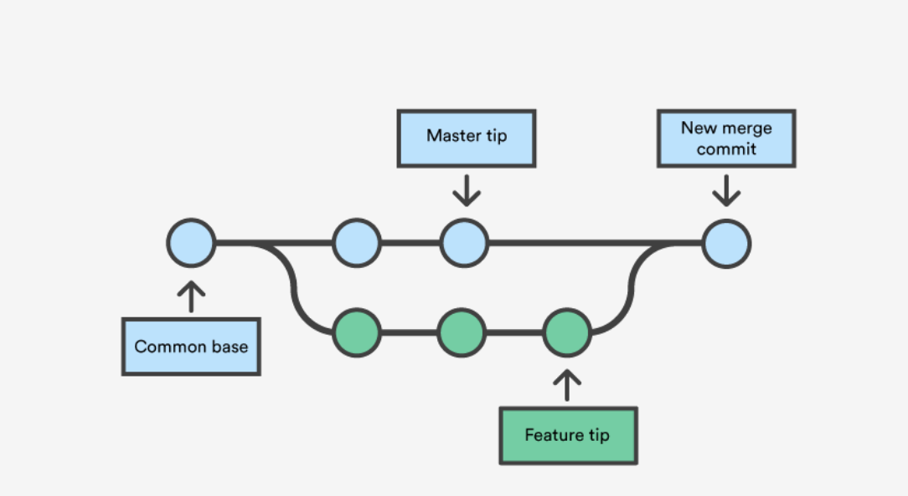

## Merging in Git

Merging is Git's way of putting a forked history back together again. The git merge command lets you take the independent lines of development created by git branch and integrate them into a single branch.

Note that all of the commands presented below merge into the current branch. The current branch will be updated to reflect the merge, but the target branch will be completely unaffected. Again, this means that git merge is often used in conjunction with git checkout for selecting the current branch and git branch -d for deleting the obsolete target branch. While merging Git tries it's best to automatically merge when possible. Which leads to several types of merge scanarios possible. First, The Fast-Forward merge. This happens in the simplest of all cases when no additional work has been detected in the paret=nt branch. Git will automatically apply changes directly apply changes from the other branch to the parent branch as if we never branched off to begin with. We can also disable such merge scanerios if undesired. Secondly, Automatic merge,This happens when git detects non- conflicting changes in the parent branch. Git is able to automatically resolve any conflicts. In doing so, the old branch's timelines are preserved and a new merge commit is created to show the merging of two branches. Third, Manual merge, This happens if Git is unable to resolve any automatic merge conflicts. Git enters a special conflicting merge case which means that all conflicts must be resolved prior of moving forward with a commit. Once all conflicts have been resolved, those changes have been saved in the merge commit.

